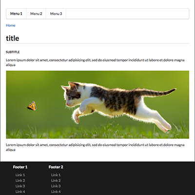

# abe-themes-default

> theme for [AbeCMS](https://github.com/abecms/abecms/)

The purpose of this repo was to create a theme manager for [AbeCMS](https://github.com/abecms/abecms/) so the theme is pretty simple
